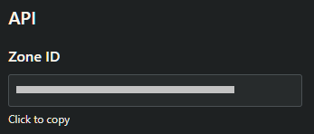

# cloudflare-ddns
Automatically update your Cloudflare DNS when your public IP changes

<p align="center">
    
    <br />
    
    
    <br />
    
</p>

## Table of Contents
- [Usage](#usage)
  - [Run using Docker](#run-using-docker)
  - [Run using `docker-compose`](#run-using-docker-compose)
- [Future Features](#future-features)

## Usage
1. [Create a Cloudflare API token](https://developers.cloudflare.com/api/tokens/create/) with at least the following configuration

    

    Permissions
    - Zone - Zone - Read
    - Zone - DNS - Edit

    Zone Resources
    - Include - All zones

2. [Identify your Cloudflare Zone ID](https://developers.cloudflare.com/fundamentals/get-started/basic-tasks/find-account-and-zone-ids/)

    

3. Create a config file following the format in [`config/default.json`](config/default.json).

    ```json
    {
        "cloudflare": {
            "apiToken": "",
            "zoneId": "",
            "recordName": ""
        },
        "interval": 5
    }
    ```

    | Config                  | Description                                                  | Example                                    |
    | ----------------------- | ------------------------------------------------------------ | ------------------------------------------ |
    | `cloudflare.apiToken`   | A Cloudflare API Token with the [proper permissions](#usage) | `XDX6YXn0MU2tpwJUa49UYLrtS5r4q-Ia9ng6H5Pu` |
    | `cloudflare.zoneId`     | The Zone ID of the domain you want to update DNS for         | `gq3pvvxfr6x4fpfdgz7w7n4d3ckfk9pk`         |
    | `cloudflare.recordName` | The name of the record you would like to update              | `example.com`                              |
    | `interval`              | How often to check your DNS records (in minutes)<sup>1</sup> | `5`                                        |

    <sup>1</sup> [Cloudflare's Rate Limits](https://support.cloudflare.com/hc/en-us/articles/200171456-How-many-API-calls-can-I-make) are pretty lenient, so feel free to set the interval as small as you want.

4. Run `cloudflare-ddns` using your `config.json`

    #### Run using Docker
    ```sh
    docker run \
        -v /path/to/config.json:/app/config/production.json \
        zachstence/cloudflare-ddns
    ```

    #### Run using `docker-compose`
    ```yaml
    version: "3.8"

    services:
    cloudflare-ddns:
        image: zachstence/cloudflare-ddns
        volumes:
        - /path/to/config.json:/app/config/production.json:ro
        restart: unless-stopped
    ```

## Future Features
- Configuration to update multiple zones/records
- Accept file for Cloudflare API token to enable better security (Docker secrets)
